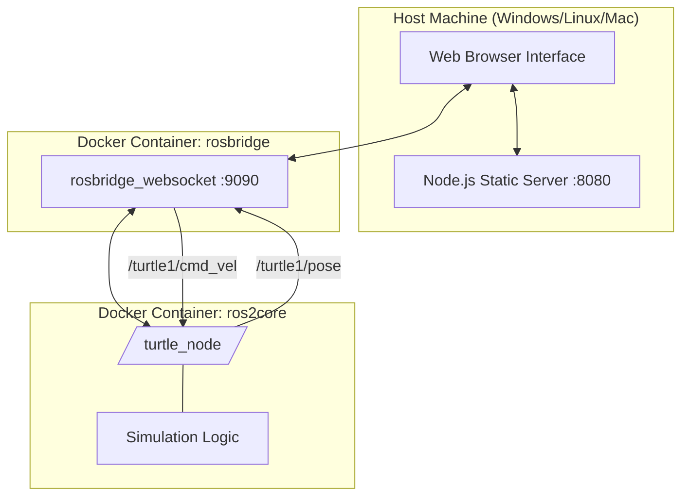
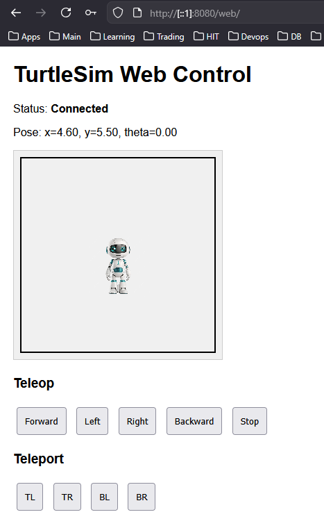
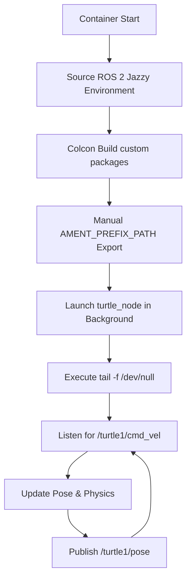
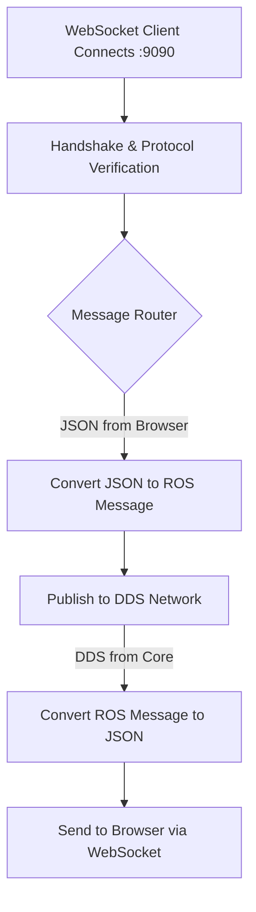
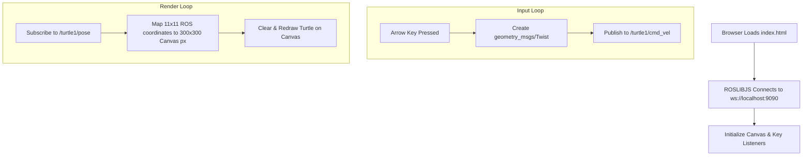
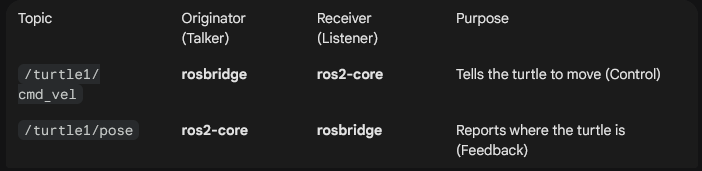

# HIT – Intelligent Autonomous Vehicle Software Development
<div align="center">

### Headless ROS 2 Simulation & Web-Interface Integration


[](https://docs.ros.org/en/jazzy/index.html)
[](https://www.docker.com/)


This repository contains a containerized ROS 2 software stack developed for the **Intelligent Autonomous Vehicle Software Development** course at HIT. The project demonstrates a modern "Headless" simulation architecture where ROS 2 handles the physics and logic in a Docker environment, while a decoupled Web Client provides visualization and control.

</div>

## 🏗 Full System Architecture


The following graph illustrates the data flow from the user's browser, through the WebSocket bridge, into the internal ROS 2 DDS network.






## 📂 Repository Structure
```
HIT-Autonomous-Vehicle-Dev/
├── docker/
│   ├── ros2-core/
│   │   └── Dockerfile              # Core ROS 2 Jazzy image
│   └── rosbridge/
│       ├── turtle_control/         # Extended bridge logic
│       ├── Dockerfile              # Bridge image with rosbridge_suite
│       ├── entrypoint.sh           # Custom container startup script
│       └── rosbridge_params.yaml   # WebSocket & server configuration
├── src/
│   └── turtle_sim_web/             # Custom ROS 2 Python package
│       ├── turtle_sim_web/         # Node implementation (turtle_node.py)
│       ├── package.xml             # Package dependencies
│       └── setup.py                # Build entry points for ROS 2
├── web/
│   ├── index.html                  # UI with HTML5 Canvas & ROSLibJS
│   ├── app.js                      # ROSLibJS Publisher/Subscriber logic
│   └── server.js                   # Node.js server for static assets
├── docker-compose.yml              # Orchestration & Volume mapping
└── README.md
```


## 🚀 Getting Started

1. Prerequisites
    Docker Desktop: Ensure WSL2 backend is enabled (for Windows users).

    Git: To clone and manage the repository.

2. Launching the System
From the root directory, execute the following command:

```
docker compose up --build
```

This command builds the custom nodes, handles environment sourcing, and initializes the internal ROS graph.

```
then, open web browser at http://localhost:8080/web/
```


## 🎮 Operational Control
Teleoperation
- Keyboard: Use the Arrow Keys (Up, Down, Left, Right) to drive the turtle on   the canvas.

- On-Screen Buttons: Use the dedicated UI buttons for manual control.

Services:
- Teleport: Use the "Teleport" buttons (TL, TR, BL, BR) 
- to instantly move the turtle to the corners via the /teleport_turtle service.


## 🛠 Technical Implementation Details

Windows-Docker Compatibility Fix

To bypass common volume-syncing delays on Windows, the docker-compose.yml
- utilizes a specialized bootstrap sequence:
  Internal Build: Runs colcon build --merge-install inside the container.

  Manual Path Injection: Explicitly exports the AMENT_PREFIX_PATH to ensure the package is discoverable immediately.

  Subshell Execution: Launches the ROS node in the background using (ros2 run ... &) and maintains the container lifecycle with tail -f /dev/null.


## ROS 2 Interface Specifications
```
Component	    Type	      Name	              Message/Service Type
Publisher	    Topic	    /turtle1/pose	        turtlesim/msg/Pose
Subscriber      Topic	    /turtle1/cmd_vel	    geometry_msgs/msg/Twist
Client/Server	Service	   /teleport_turtle	      std_srvs/srv/SetBool
```


## 🛠 Technologies
- Middleware: ROS 2 Jazzy Jalisco
- Communication: WebSockets, DDS (Data Distribution Service)
- Frontend: HTML5 Canvas, JavaScript, ROSLIBJS
- Infrastructure: Docker & Docker Compose
- Backend: Node.js


## ros2-core Service Flow
This is the Authoritative Logic Layer. 
It handles the physics of the simulation and the ROS 2 computation graph.



Key Technical Details:
- Ament Prefix Path:
 We manually export this because, on Windows, the file system sync between the host and container can be slow. This command tells ROS exactly where the newly built binaries are located without waiting for a system refresh.

- Backgrounding (&):
We run the node in the background so the script can reach the tail command.

- Tail -f:
This is a "keep-alive" hack. Since ROS nodes are processes, if they crash, the container usually dies. This command ensures the container stays "Running" so you can debug it.

## rosbridge Service Flow
This is the Translation Layer. 
It acts as a bridge between the binary world of ROS 2 (DDS) and the JSON world of the Web.



## web-ui (Frontend) Flow
This is the Interaction Layer. 
It handles user input and visualizes data on the HTML5 Canvas.



Key Technical Details:
- Coordinate Mapping:
ROS 2 Turtlesim uses a coordinate system (usually 11.0×11.0). The JavaScript code must scale these numbers to pixels (e.g., 300×300) so the turtle appears in the correct spot on your screen.

- ROSLIBJS:
This library handles the "heavy lifting" of maintaining the WebSocket connection and re-connecting if the bridge drops.


## Final input 

The Topic Ownership

In ROS 2, a topic is like a phone line, many people can be on the line at once.

- /turtle1/pose:

        Publisher: ros2-core (the turtle_node). 
        It calculates the physics and tells everyone, "I am at (x,y)."
        Subscriber: rosbridge (which then sends it to your Web UI).

- /turtle1/cmd_vel:

        Publisher: rosbridge (It receives a JSON "Up Arrow" from your browser, converts it to a ROS message, and shouts it out).
        Subscriber: ros2-core (The turtle_node hears this and moves the turtle).


  

</div>